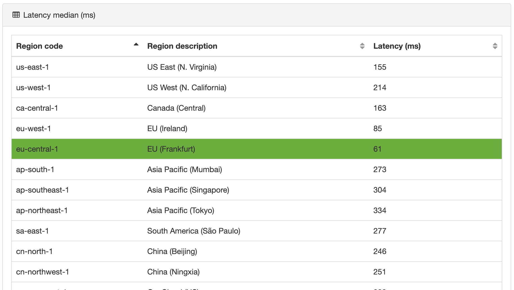

# 2020-01 Links: AWS S3, Ping

[AWS: Latency test](https://ping.psa.fun/)

[AWS: Optimizing Amazon S3 Performance](https://docs.aws.amazon.com/AmazonS3/latest/dev/optimizing-performance.html)
> For example, your application can achieve at least 3,500 PUT/COPY/POST/DELETE and 5,500 GET/HEAD requests per second per prefix in a bucket. There are no limits to the number of prefixes in a bucket. You can increase your read or write performance by parallelizing reads. For example, if you create 10 prefixes in an Amazon S3 bucket to parallelize reads, you could scale your read performance to 55,000 read requests per second.

[Rust: Tonic: gRPC + async/await!](https://luciofran.co/tonic-grpc-has-come-to-async-await/)

[Rust: Monorepo with AWS serverless apps](https://github.com/softprops/serverless-aws-rust-multi)

[Kubernetes: clusters for the hobbyist](https://github.com/hobby-kube/guide)

[Kubernetes: Install a cluster on Hetzner cloud servers](https://community.hetzner.com/tutorials/install-kubernetes-cluster)

[Helm: version 3 values](https://v2.helm.sh/docs/chart_best_practices/#consider-how-users-will-use-your-values)

[Helm: should support reading the values file from STDIN](https://github.com/helm/helm/issues/2709)

[Helm: Support reading values from STDIN for `upgrade` command](https://github.com/helm/helm/issues/7002)

[Hosting: Cheap VPS for development on Contabo](https://contabo.com/?show=configurator&vserver_id=221)
