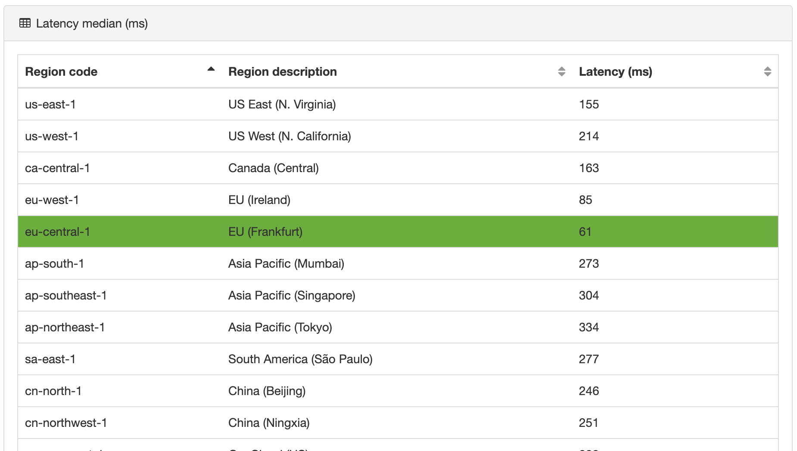

# 2020-01 Links: AWS S3, Ping

[AWS: Latency test](https://ping.psa.fun/)

[RUST: Tonic: gRPC + async/await!](https://luciofran.co/tonic-grpc-has-come-to-async-await/)

[Kubernetes: clusters for the hobbyist](https://github.com/hobby-kube/guide)

[Kubernetes: Install a cluster on Hetzner cloud servers](https://community.hetzner.com/tutorials/install-kubernetes-cluster)

[Helm: version 3 values](https://v2.helm.sh/docs/chart_best_practices/#consider-how-users-will-use-your-values)

[Helm: should support reading the values file from STDIN](https://github.com/helm/helm/issues/2709)

[Helm: Support reading values from STDIN for `upgrade` command](https://github.com/helm/helm/issues/7002)

