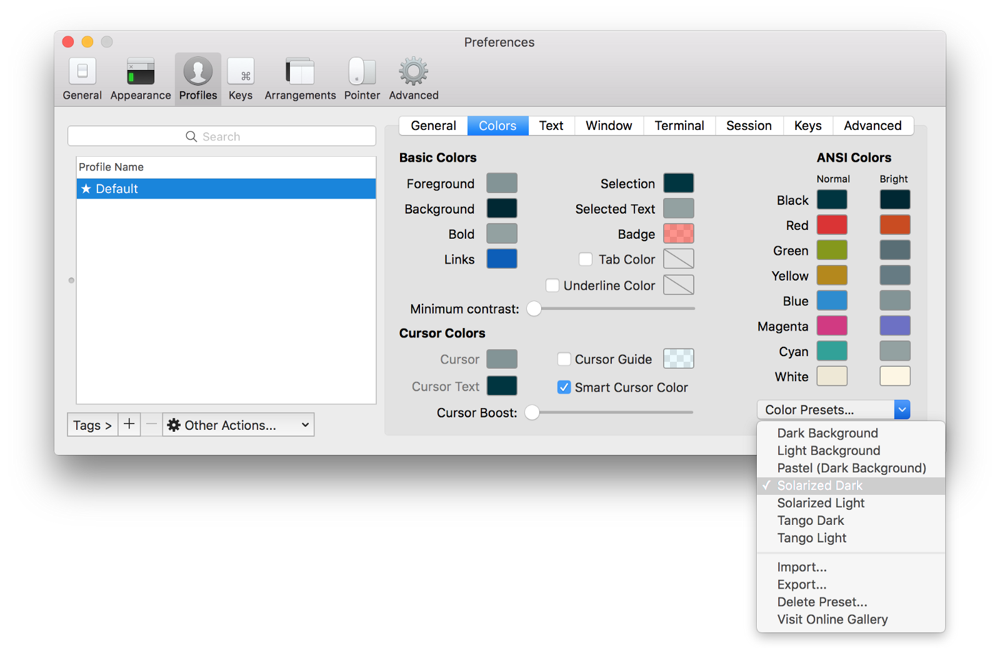
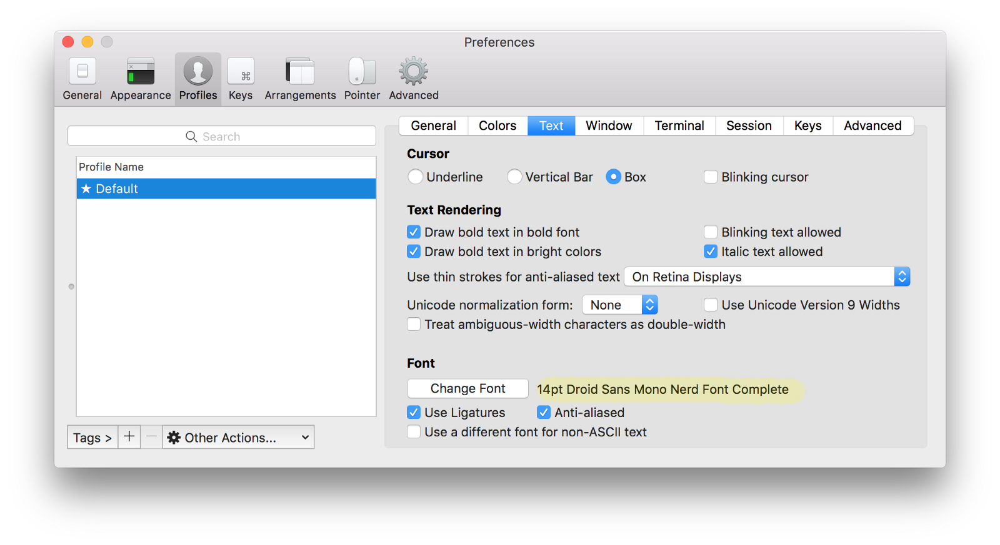
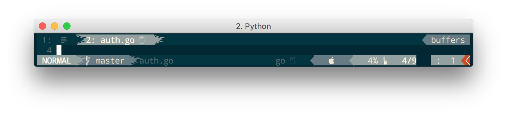
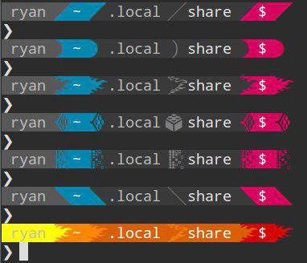
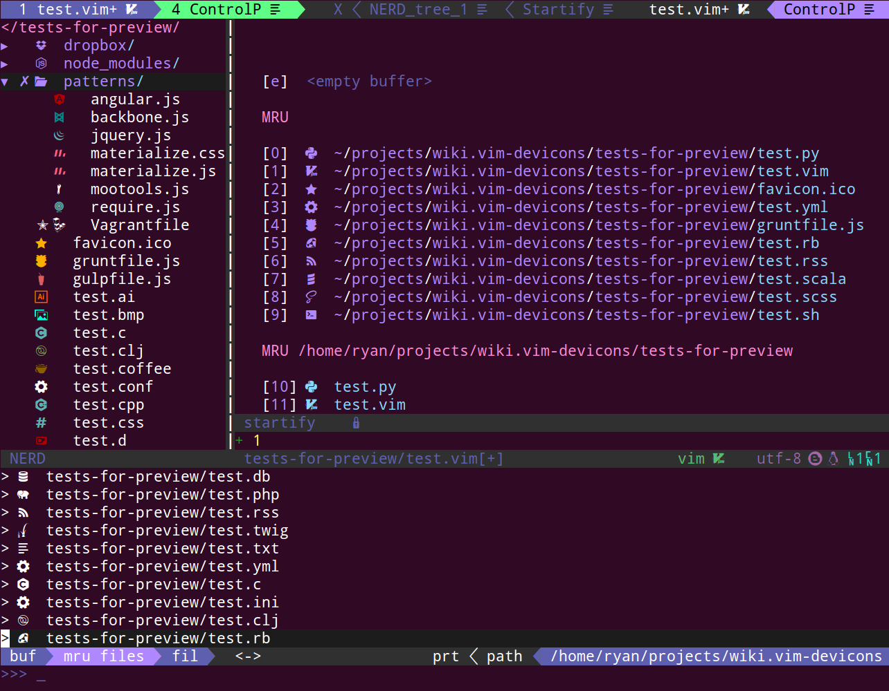

# VIM recipes

This is my list of VIM recipes. It might be interesting for beginners that have basic knowledge about VIM and familiar with VIM cheat sheet. There are a lot of VIM plugins can be found at https://vimawesome.com and you can easily get lost in this universe, but I strongly recommends to precisely look at top 20 of them. My minimalistic config can be found at the end of this note.


Contents:
- [Install Neovim with custom alias](#install-neovim-with-custom-alias)
- [Choose color scheme](#choose-color-scheme)
- [Install status bar](#install-status-bar)
- [Install Icons](#install-icons)
- [Setup file explorer](#setup-file-explorer)
- [Setup incremental search of files, buffers, tags](#setup-incremental-search-of-files-buffers-tags)
- [Setup Git plugins](#setup-git-plugins)
- [Setup code syntax hilighting](#setup-code-syntax-hilighting)
- [Setup code linting](#setup-code-linting)
- [Setup code completion](#setup-code-completion)
- [Save file on C-s](#save-file-on-c-s)
- [Set current directory to current file](#set-current-directory-to-current-file)
- [Show current directory file list](#show-current-directory-file-list)
- [Show code indentations](#show-code-indentations)
- [Switch between buffers](#switch-between-buffers)
- [Jump within screen](#jump-within-screen)
- [Jump between splits](#jump-between-splits)
- [Commenting](#commenting)
- [Expanding selection](#expanding-selection)
- [Go to definition in new split](#go-to-definition-in-new-split)
- [Golang development](#golang-development)
- [Typescript development](#typescript-development)
- [My VIM config](#my-vim-config)


## Install Neovim with custom alias
Install Neovim
```
brew install neovim
```

Install ctags
```
brew install --HEAD universal-ctags/universal-ctags/universal-ctags
```

Install vim-plug

```
curl -fLo ~/.local/share/nvim/site/autoload/plug.vim --create-dirs \
    https://raw.githubusercontent.com/junegunn/vim-plug/master/plug.vim
```

If you need several configs for different purposes, you can use aliases. For example, I have alias devvim for my neovim development config. Create new file ~/.devvimrc and add alias to ~/.bash_profile.

```
alias devvim=’nvim -u ~/.devvimrc’
```

Use different plugins folder (~/.devvim/plugged) for each config.

```
cat <<EOF > ~/.devvimrc
call plug#begin('~/.devvim/plugged')
" Tag reindexer
Plug 'ludovicchabant/vim-gutentags'
call plug#end()

" Clipboard integration
set clipboard=unnamed
" Enable syntax highlighting
syntax on
" Display line numbers
set number
" Encoding UTF-8
set encoding=utf-8

" A tab is 4 spaces
set tabstop=4
" Always uses spaces instead of tabs
set expandtab
" Insert 4 spaces when tab is pressed
set softtabstop=4
" An indent is 4 spaces
set shiftwidth=4
" Round indent to nearest shiftwidth multiple
set shiftround

" OSX stupid backspace fix
set backspace=indent,eol,start

" Search
set incsearch
set hlsearch
set ignorecase
set smartcase
nnoremap <leader><space> :nohlsearch<CR>

" Disable search hilighting
nmap <esc><esc> :noh<CR>
EOF
```

Now you can use devvim as terminal command. Do not forget to run :PlugInstall command each time you change plugin section of config.


## Choose color scheme

I prefer to use dark solarized theme

```
call plug#begin('~/.devvim/plugged')
...
" Solarized theme
Plug 'altercation/vim-colors-solarized'
...
call plug#end()
" Solarized theme
set background=dark
colorscheme solarized
```

Choose the same color theme in iTerm



## Install status bar
Vim-airline is the most used status/tabline plugin.
Install NerdFonts from https://nerdfonts.com/ to get custom edge corners with airline. I prefer Droid Sans Mono Nerd Font Complete.
Set installed font in iTerm.



Install vim-airline plugin and customize symbols.

```
call plug#begin('~/.devvim/plugged')
...
" Status bars
Plug 'vim-airline/vim-airline'
Plug 'vim-airline/vim-airline-themes'
...
call plug#end()
" Airline
" Enable Airline
let g:airline#extensions#branch#enabled = 1
" Show list of buffers in tabline
let g:airline#extensions#tabline#enabled = 1
" Show just the filename in tabline
let g:airline#extensions#tabline#fnamemod = ':t'
" Use fonts
let g:airline_powerline_fonts = 1
if !exists('g:airline_symbols')
     let g:airline_symbols = {}
endif
" Airline symbols
let g:airline_left_sep = "\uE0C0"
let g:airline_right_sep = "\uE0C2"
let g:airline_symbols.linenr = '␤'
let g:airline_symbols.branch = '⎇'
let g:airline_symbols.paste = 'ρ'
let g:airline_symbols.paste = 'Þ'
let g:airline_symbols.paste = '∥'
let g:airline_symbols.whitespace = 'Ξ'
" Airline theme
let g:airline_solarized_bg='dark'
```

For example, with let g:airline_left_sep = “\uE0C0” you can get flame-looking edges.



Here’s a couple of other examples



## Install Icons

VimDevIcons adds filetype glyphs (icons) to other plugins such as NERDTree, vim-airline, CtrlP.

```
call plug#begin('~/.devvim/plugged')
...
" DevIcons
Plug 'ryanoasis/vim-devicons'
...
call plug#end()
```



## Setup file explorer
I use NERDTree as a file explorer, prefer place it on the right side and open on demand by C-n.

- C-n : toggle NERDTree

In NERDTree split:

- m : file options, d for deleting file or folder for example.


```
call plug#begin('~/.devvim/plugged')
...
" NerdTree file explorer
Plug 'scrooloose/nerdtree', { 'on':  'NERDTreeToggle' }
...
call plug#end()
" NERDTree
" Toggle NERDTree on the right side by C-n
noremap  <c-n> :NERDTreeToggle<cr>
" Place NERDTree to right
let g:NERDTreeWinPos = "right"
let g:NERDTreeQuitOnOpen = "1"
```

## Setup incremental search of files, buffers, tags

CtrlP is the most popular plugin for file/buffer/tag inscremental search. I prefer to open search in mixed mode by default.

- C-p : open CtrlP
- C-i : open tag search

```
call plug#begin('~/.devvim/plugged')
...
" CtrlP file, buffer, tag search
Plug 'ctrlpvim/ctrlp.vim'
...
call plug#end()
" CtrlP
" CtrlP file, buffer, tag search
let g:ctrlp_extensions = ['mixed', 'changes', 'quickfix']
let g:ctrlp_cmd = 'call CallCtrlP()'
" Search tags with Ctrl-i
noremap <c-i> :CtrlPTag<CR>
func! CallCtrlP()
    if exists('s:called_ctrlp')
        CtrlPLastMode
    else
        let s:called_ctrlp = 1
        CtrlPMixed
    endif
endfunc
```

Another popular option for file search is fzf. Install fzf command line tool with brew.

```
brew install fzf
```

After installing fzf plugin you can use <leader>e for searching.

- <leader>e : fuzzy search with fzf

```
call plug#begin('~/.devvim/plugged')
...
" Fuzzy file search
Plug 'junegunn/fzf', { 'dir': '~/.fzf', 'do': './install --all' }
...
call plug#end()
```

## Setup Git plugins

```
call plug#begin('~/.devvim/plugged')
...
" Git plugins
Plug 'tpope/vim-fugitive'
Plug 'airblade/vim-gitgutter'
Plug 'junegunn/gv.vim'
...
call plug#end()
```

## Setup code syntax hilighting

```
call plug#begin('~/.devvim/plugged')
...
" Polyglot syntax hilighting
Plug 'sheerun/vim-polyglot'
...
call plug#end()
```

## Setup code linting

For asynchronous code lining use ALE (Asynchronous Lint Engine).

```
call plug#begin('~/.devvim/plugged')
...
" Asynchronous Code Linting
Plug 'w0rp/ale'
...
call plug#end()
" Enable integration with airline.
let g:airline#extensions#ale#enabled = 1
```

Do not forget install language plugins.

## Setup code completion

- Tab : complete
- Shift-j : move up in completion list
- Shift-k : move down in completion list

```
call plug#begin('~/.devvim/plugged')
...
" Deoplete: code completion tool
Plug 'Shougo/deoplete.nvim', { 'do': ':UpdateRemotePlugins' }
" Use TAB for code completion
Plug 'ervandew/supertab'
...
call plug#end()
" Deoplete: code completion tool
" Enable deoplete at startup
let g:deoplete#enable_at_startup = 1
" Select from completion list with SHIFT-j/k
inoremap <expr> <S-j> ("\<C-n>")
inoremap <expr> <S-k> ("\<C-p>")
```

## Save file on C-s

- C-s : save file

```
" Save file with C-s
nnoremap <silent><C-s> :w<CR>
```

## Set current directory to current file
I set working directory to the current file with ,cd sequence.

- ,cd : Set current directory to current file

```
" Set current directory to current file with ,cd
nnoremap ,cd :cd %:p:h<CR>:pwd<CR>
```

## Show current directory file list

Actually you can do it with CrtlP, but sometimes it can be comfortably with vim-dirvish.

- \- : Open parent directory

```
call plug#begin('~/.devvim/plugged')
...
" Dirvish: directory navigation
Plug 'justinmk/vim-dirvish'
...
call plug#end()
```

## Show code indentations

```
call plug#begin('~/.devvim/plugged')
...
" Indent line
Plug 'yggdroot/indentline'
...
call plug#end()
```

## Switch between buffers
If you have installed vim-airline, you can show number of buffer in tabbar.

```
" Switch beetween buffers: show buffer number in Airline
let g:airline#extensions#tabline#buffer_nr_show = 1
I found it useful to bind buffer switching by number on <leader><buffer number>.
" Switch beetween buffers: switch with number
nnoremap <leader>1 :1b<CR>
nnoremap <leader>2 :2b<CR>
nnoremap <leader>3 :3b<CR>
nnoremap <leader>4 :4b<CR>
nnoremap <leader>5 :5b<CR>
nnoremap <leader>6 :6b<CR>
nnoremap <leader>7 :7b<CR>
nnoremap <leader>8 :8b<CR>
nnoremap <leader>9 :9b<CR>
```

## Jump within screen
You can navigate within screen by pressing ancor keys using vim-easymotion plugin. I bind motion to beginning of word to <Space> and use it as one of primary command for movements.

- <Space> : easy motion to any word

```
call plug#begin('~/.devvim/plugged')
...
" EasyMotion: effective movements
Plug 'easymotion/vim-easymotion'
...
call plug#end()
" Press <Space> for bidirectional easy movements
map <Space> <Plug>(easymotion-bd-w)
```

## Jump between splits
With vim-tmux-navigator plugin you can:

- C — h : go to left split
- C — j : go to down split
- C — k : go to up split
- C — l: go to right split
- C — /: go to previous split

```
call plug#begin('~/.devvim/plugged')
...
" Jump between splits with Ctrl
Plug 'christoomey/vim-tmux-navigator'
...
call plug#end()
```

## Commenting
For commenting I bind slash (/) to NERDCommenterToggle command from nerdcommenter plugin. In visual mode (v) you can select one or multiple lines and press slash to toggle comments.

- / : toggle comment in visual mode

```
call plug#begin('~/.devvim/plugged')
...
" NerdCommenter
Plug 'scrooloose/nerdcommenter'
...
call plug#end()
" Toggle comment in visual mode
vmap <silent>/ <Plug>NERDCommenterToggle
```

## Expanding selection

I have it found useful to use vim-expand-region plugin for incremental selection.

- \+ : expand the visual selection with vim-expand-region
- \_ : shrink the visual selection with vim-expand-region

```
call plug#begin('~/.devvim/plugged')
...
" Incremental expand selection
Plug 'terryma/vim-expand-region'
...
call plug#end()
```

## Go to definition in new split
Often you need to open definition in a new split.

- fd : go to definition in new split

```
" Go to definition in new split
nnoremap <silent>fd <C-w>v<C-w>w :call feedkeys("gd")<CR>
```

## Golang development
Assume vim-polyglot installed.

```
call plug#begin('~/.devvim/plugged')
...
" Golang
Plug 'fatih/vim-go', { 'do': ':GoInstallBinaries' }
" Completion tool for golang
Plug 'nsf/gocode', { 'tag': 'v.20150303', 'rtp': 'vim' }
" Golang completion tool for deoplete
Plug 'zchee/deoplete-go', { 'do': 'make'}
...
call plug#end()
```

## Typescript development
Assume vim-polyglot installed.

```
call plug#begin('~/.devvim/plugged')
...
" Typescript
Plug 'quramy/tsuquyomi'
Plug 'Shougo/vimproc.vim', {'do' : 'make'}
...
call plug#end()
```

## My VIM config
Paste to save config to ~/.devvimrc

```
cat <<EOF > ~/.devvimrc
call plug#begin('~/.devvim/plugged')
" Tag reindexer
Plug 'ludovicchabant/vim-gutentags'
" Solarized theme
Plug 'altercation/vim-colors-solarized'
" Status bars
Plug 'vim-airline/vim-airline'
Plug 'vim-airline/vim-airline-themes'
" DevIcons
Plug 'ryanoasis/vim-devicons'
" NerdTree file explorer
Plug 'scrooloose/nerdtree', { 'on':  'NERDTreeToggle' }
" CtrlP file, buffer, tag search
Plug 'ctrlpvim/ctrlp.vim'
" Fuzzy file search
Plug 'junegunn/fzf', { 'dir': '~/.fzf', 'do': './install --all' }
" Git plugins
Plug 'tpope/vim-fugitive'
Plug 'airblade/vim-gitgutter'
Plug 'junegunn/gv.vim'
" Polyglot syntax hilighting
Plug 'sheerun/vim-polyglot'
" Asynchronous Code Linting
Plug 'w0rp/ale'
" Deoplete: code completion tool
Plug 'Shougo/deoplete.nvim', { 'do': ':UpdateRemotePlugins' }
" Use TAB for code completion
Plug 'ervandew/supertab'
" Dirvish: directory navigation
Plug 'justinmk/vim-dirvish'
" Indent line
Plug 'yggdroot/indentline'
" EasyMotion: effective movements
Plug 'easymotion/vim-easymotion'
" Jump between splits with Ctrl
Plug 'christoomey/vim-tmux-navigator'
" NerdCommenter
Plug 'scrooloose/nerdcommenter'
" Incremental expand selection
Plug 'terryma/vim-expand-region'
" Golang
Plug 'fatih/vim-go', { 'do': ':GoInstallBinaries' }
" Completion tool for golang
Plug 'nsf/gocode', { 'tag': 'v.20150303', 'rtp': 'vim' }
" Golang completion tool for deoplete
Plug 'zchee/deoplete-go', { 'do': 'make'}
" Typescript
Plug 'quramy/tsuquyomi'
Plug 'Shougo/vimproc.vim', {'do' : 'make'}
call plug#end()
" Clipboard integration
set clipboard=unnamed
" Enable syntax highlighting
syntax on
" Display line numbers
set number
" Encoding UTF-8
set encoding=utf-8
" A tab is 4 spaces
set tabstop=4
" Always uses spaces instead of tabs
set expandtab
" Insert 4 spaces when tab is pressed
set softtabstop=4
" An indent is 4 spaces
set shiftwidth=4
" Round indent to nearest shiftwidth multiple
set shiftround
" OSX stupid backspace fix
set backspace=indent,eol,start
" Search
set incsearch
set hlsearch
set ignorecase
set smartcase
nnoremap <leader><space> :nohlsearch<CR>
" Disable search hilighting
nmap <esc><esc> :noh<CR>
" Solarized theme
set background=dark
colorscheme solarized
" Airline
" Enable Airline
let g:airline#extensions#branch#enabled = 1
" Show list of buffers in tabline
let g:airline#extensions#tabline#enabled = 1
" Show just the filename in tabline
let g:airline#extensions#tabline#fnamemod = ':t'
" Use fonts
let g:airline_powerline_fonts = 1
if !exists('g:airline_symbols')
     let g:airline_symbols = {}
endif
" Airline symbols
let g:airline_left_sep = "\uE0C0"
let g:airline_right_sep = "\uE0C2"
let g:airline_symbols.linenr = '␤'
let g:airline_symbols.branch = '⎇'
let g:airline_symbols.paste = 'ρ'
let g:airline_symbols.paste = 'Þ'
let g:airline_symbols.paste = '∥'
let g:airline_symbols.whitespace = 'Ξ'
" Airline theme
let g:airline_solarized_bg='dark'
" NERDTree
" Toggle NERDTree on the right side by C-n
noremap  <c-n> :NERDTreeToggle<cr>
" Place NERDTree to right
let g:NERDTreeWinPos = "right"
let g:NERDTreeQuitOnOpen = "1"
" CtrlP
" CtrlP file, buffer, tag search
let g:ctrlp_extensions = ['mixed', 'changes', 'quickfix']
let g:ctrlp_cmd = 'call CallCtrlP()'
" Search tags with Ctrl-i
noremap <c-i> :CtrlPTag<CR>
func! CallCtrlP()
    if exists('s:called_ctrlp')
        CtrlPLastMode
    else
        let s:called_ctrlp = 1
        CtrlPMixed
    endif
endfunc
" Enable integration with airline.
let g:airline#extensions#ale#enabled = 1
" Deoplete: code completion tool
" Enable deoplete at startup
let g:deoplete#enable_at_startup = 1
" Select from completion list with SHIFT-j/k
inoremap <expr> <S-j> ("\<C-n>")
inoremap <expr> <S-k> ("\<C-p>")
" Save file with C-s
nnoremap <silent><C-s> :w<CR>
" Set current directory to current file with ,cd
nnoremap ,cd :cd %:p:h<CR>:pwd<CR>
" Switch beetween buffers: show buffer number in Airline
let g:airline#extensions#tabline#buffer_nr_show = 1
" Switch beetween buffers: switch with number
nnoremap <leader>1 :1b<CR>
nnoremap <leader>2 :2b<CR>
nnoremap <leader>3 :3b<CR>
nnoremap <leader>4 :4b<CR>
nnoremap <leader>5 :5b<CR>
nnoremap <leader>6 :6b<CR>
nnoremap <leader>7 :7b<CR>
nnoremap <leader>8 :8b<CR>
nnoremap <leader>9 :9b<CR>
" Press <Space> for bidirectional easy movements
map <Space> <Plug>(easymotion-bd-w)
" Toggle comment in visual mode
vmap <silent>/ <Plug>NERDCommenterToggle
" Go to definition in new split
nnoremap <silent>fd <C-w>v<C-w>w :call feedkeys("gd")<CR>
EOF
```